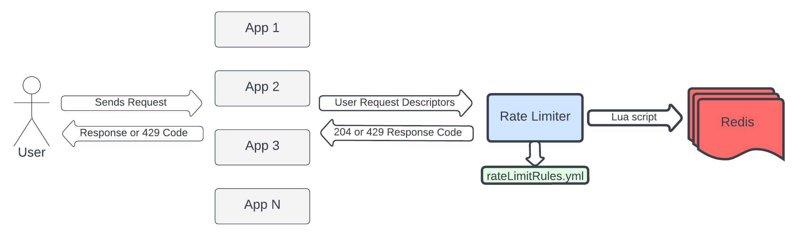

# Redis Rate Limiter 

Spring Boot app, that has REST endpoint to check and decrement rate limits based on provided request descriptors:

One request can be described by several descriptors to match different rules simultaneously. 
Request descriptor can have the following fields (at least one is required): clientIp, accountId, requestType.

Rate limit rules are configured in `src/main/resources/rateLimitRules.yml` file. Rate limit rule fields:
- clientIp - string, optional, can be empty
- accountId - string, optional, can be empty
- requestType - string, optional, can't be empty
- timeInterval - enum (SECOND, MINUTE, HOUR, DAY), required
- allowedRequestsNumber - integer, required

If clientIp or accountId is empty in the rule, each distinct clientIp or accountId 
will be associated with its own counter in Redis.

## How to Run

1. Run `docker-compose up -d` to start Spring Boot application, Redis and Redis UI.
2. Import `Redis Rate Limiter.postman_collection.json` file to your Postman to call rate limit endpoint.
3. (Optional) To check Swagger documentation visit http://localhost:8080/redis/swagger-ui/index.html.
4. (Optional) To use Redis UI: visit `http://localhost:8001` in browser -> click `I already have a database` -> 
`Connect to a Redis Database` -> host - 173.18.0.3, port - 6379, name - enter anything -> 
`Select all` -> `Add cluster database`.

## Technical notes

- Spring Boot 3 and Java 17 are used.
- Code coverage threshold: 85%.
- Unit tests: JUnit 5, Mockito. Integration tests: MockMvc, TestContainers.
- Checkstyle is configured.
